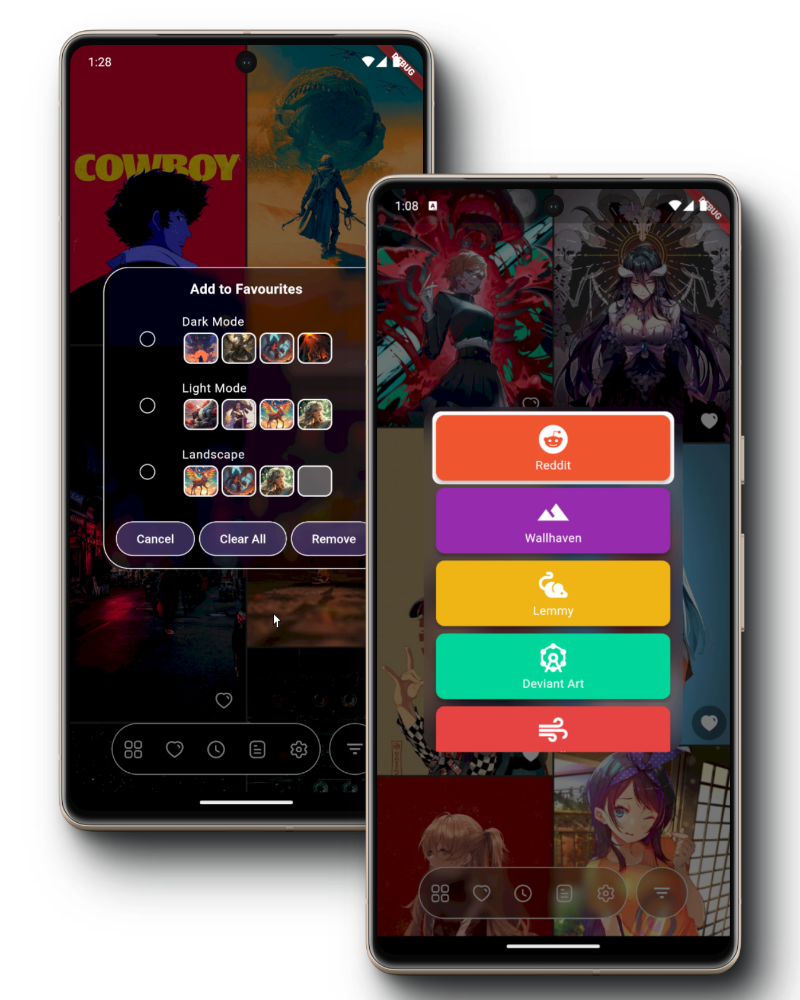

# Yet Another Wallpaper App

This is a simple wallpaper app that uses various sources including: Reddit, Wallhaven, Lemmy, Deviant Art and many more to come.

As of now, you can do the following:
* Browse through the wallpapers from the above mentioned sources.
* Download wallpapers
* Favorite wallpapers(In multiple folders)
* Change the wallpaper(Work in progress, bugged)

There are many more features that will be added in the future. This is supposed to be your goto ultimate wallpaper app.

> [!Important]
> This project is currently in development. You can still build and test it, but it is not yet ready for use.
